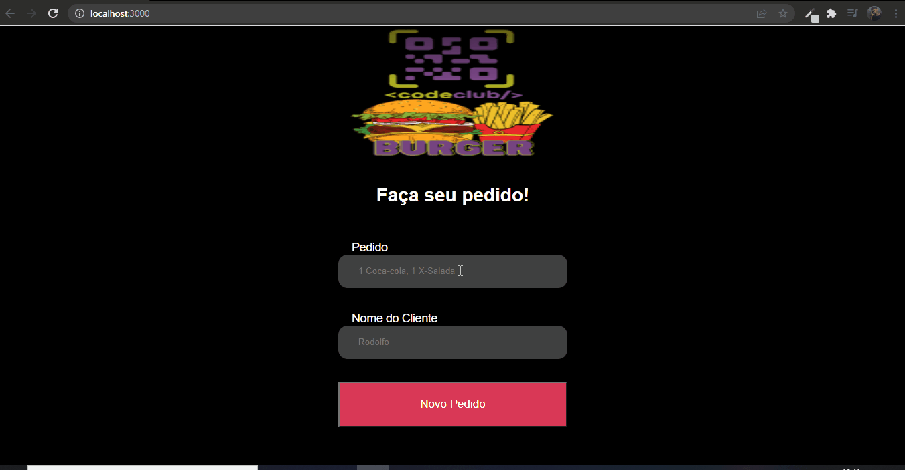

# Pedido de Lanches 🍔 

> Parte front-end do projeto Pedido de Lanches. Adicionamos o nosso pedido e nosso nome, jogando pra outra tela. Conceitos como hooks, router-dom, components, rotas..
### Tecnologias usadas:
 
 
 
 

 
 

    
##
    
🤝 Colaboradores
 
<a href="https://www.linkedin.com/in/marcusviniciusbeghelisantos/" target="_blank">Marcus Vinícius</a>

